<h1 align="center">Hi 👋, I'm Victor</h1>

  

  

### 🧑‍💻 About me

Software engineer with <!-- YEARS_EXP -->4<!-- /YEARS_EXP -->+ years of professional experience, backend-leaning. Mostly Python/Django/Wagtail, with a thing for automation. I release open source tools when I find a problem worth solving.

Recently built [kwelea](https://github.com/engineervix/kwelea), a standalone docs site generator, and [pseudoc](https://github.com/engineervix/pseudoc), which generates fake PDF, Word, and Excel files for testing workflows.
I write at [blog.victor.co.zm](https://blog.victor.co.zm). Python, Django, Wagtail, Linux questions welcome: victormiti (at) gmail (dot) com.

<h3 align="left">Connect with me:</h3>

### 🛠 Languages and Tools

  

### 📝 Latest Blog Posts

<!-- BLOG-POST-LIST:START -->
- [Hello Neovim](https://blog.victor.co.zm/hello-neovim) — Feb 11, 2026
- [From MS Word to LaTeX to Markdown: Taking the stress out of managing my CV](https://blog.victor.co.zm/taking-the-stress-out-of-managing-my-cv) — Aug 27, 2025
- [Adding Your Own Context Menu Entries to GNOME Files (Nautilus)](https://blog.victor.co.zm/custom-nautilus-context-menu-python-extension) — Apr 26, 2025
- [Build it Yourself: When a 2MB Solution Beats a 1GB Installation](https://blog.victor.co.zm/build-it-yourself-native-rpm-vs-flatpak) — Dec 18, 2024
- [Automating Atomic Poetry Dependency Updates with Bash](https://blog.victor.co.zm/automating-atomic-poetry-dependency-updates-with-bash) — Sep 18, 2024
<!-- BLOG-POST-LIST:END -->

### 📊 GitHub Stats

  
  

  

### 🐍 Contribution Activity

  <picture>
    <source media="(prefers-color-scheme: dark)" srcset="https://raw.githubusercontent.com/engineervix/engineervix/output/github-contribution-grid-snake-dark.svg">
    <source media="(prefers-color-scheme: light)" srcset="https://raw.githubusercontent.com/engineervix/engineervix/output/github-contribution-grid-snake.svg">
    
  </picture>

### ☕ Support

  

